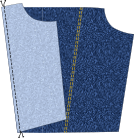
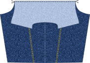
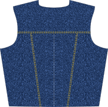
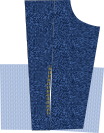
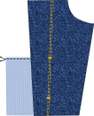

:::note

###### Top stitching ahead!

Devon needs tropstitching on almost all seams. Just like your favourite pair of jeans, Devon uses top
stitching extensively. After sewing a seam, you will have to finish it, press it to one side, and top stitch it.
This means that you will have to set up two sewing machines, or apply some strategy to sewing the seams to minimize
changing threads.

With only a couple exceptions, you can leave the bobbin thread between sewing the seam, and the top stitching. Where
you need to change the bobbin, it'll be referenced here in the instructions.

Each seam should get two rows of top stitching. One close to the seam, and one a little further away. There is no
right or wrong way to do this, whatever you like best. Look at a couple of jeans and see what the distance
between the rows of stitching is. But if you'd like something different, that's fine too. Or leave the
second row out all together. Be creative.

:::

:::note

The seams should be finished. You can do this with an overlocking stitch, or flat-fell the seam. There is
no additional fabric included in the seam allowances for flat felling the seam. If you prefer that finish, make
sure you add the required extra fabric to the appropriate seams.

:::

### Step 1: Back

- Sew the Back Outside to the Back Panel
- Press the seams toward the Back Panel
- Finish and top stitch the seams

- Matching the center, pin the Back Yoke to the back
- Sew along the seam.

- Press the seam up (towards the yoke)
- Finish and top stitch the seam

### Step 2: Front

:::note
If you have omitted the front pocket, just sew the Front Side to the Front Panel, finish and top stitch.
You can skip the pocket construction part below
:::

- Lay the Front Outside Panel on the Front Panel, matching the top side and the square flaps
- Sew along the edge above the square flap to the top notch
- Sew from the bottom notch to the middle notch
  You basically sew a seam with part in the middle left open

Press the seam open. On the front panel, with the square flap pointing away from the opening,
sew two lines of top stitching between the notches (the part you left open). Pull the ends of the
threads to the wrong side and finish.

Pull the other flap to the front panel side and align with the other flap. Sew the top of the
flaps together. You can sew the other sides together too, but they will be caught into the
front facing and waistband, so there is no real need to do so. Finish the seam and top of the flap.
Now top stitch the rest of the seam, stopping at the notches, matching the part you have already
done. Pull threads to the wrong side and finish off.
Add some bar tacks to where the notches are to strengthen the pocket opening.

Sew the front inside panel to the front panel. Press the seam towards the front panel, finish,
and top stitch.

Give the resulting panel a good press.

On the front inside panel and the front outside panel, clip from the top to the notch.
Press the little flap you created down towards the front panel. Press and top stitch.
Bonus points if you first finish this little part.

Finish all the sides of the pocket parts.

Center the pocket part over the opening you just created, aligning the top of the
pocket part with the top of the front panel. Top stitch along the lines indicated
on the pattern pieces, securing the pocket to the front part.

Create two big bar tacks along the side of the opening, strengthening the pocket opening.

Stitch two pocket flaps together along the sides and bottom, wrong sides together. clip
corners, grade seams, and pull inside out. Press the pocket flap and top stitch along
the sides and bottom.

Create the button hole. You don't want to wait until the end to do this.

Lay the pocket flap on the right side of the front, centered over the already
sewn pocket. Align the front with
:::note
It is best practice to make a paper pattern from the mock-up if you have made any alterations, as this will allow you to clean up any lines but also means you have a pattern that you can keep producing garments from.
:::

### Bent is a block, looking for a finalised pattern?

> Here are some of the patterns based on Bent:
> [Carlton](https://freesewing.org/designs/carlton),
> [Carlita](https://freesewing.org/designs/carlita),
> and
> [Jaeger](https://freesewing.org/designs/jaeger).
