This pattern is hard to fit around the arms in the same ways Simon is hard to fit around the arms, and
complicated at the waistband and cuffs in similar ways to how Huey and Hugo are complicated at the
waistband and cuffs. If you've already made those things, this pattern will feel pretty familiar. If you
haven't, take it slow and make a muslin out of some cheap cloth first.

### Decide on button placket layer

Decide whether to make your button placket out of the outer shell or the lining. The button placket will
involve 3 layers of the placket fabric folded over - if that'll be unwieldy with your outer shell fabric,
use the lining for it instead.

For whichever material you're **not** using for the button placket, take the fronts and trim them to the
green line with no seam allowance. This'll let their raw edges sit snug inside the button placket.

This image shows the front lining sitting on top of the front shell, trimmed to the green line (outlined
in black). When the pocket piece is aligned with the pocket marking on the front (purple line, outlined
in white), the raw edge of the pocket should likewise be flush with the green line.

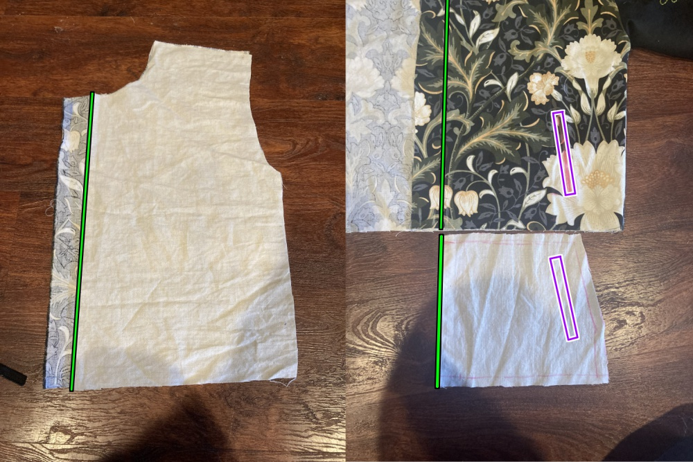

### Sew the pockets

There are several approaches to sewing welt pockets. [This video](https://youtu.be/KmyIdBhdcWk) outlines
one method I like. Follow along with it if a visual guide would help you, or use a different method if you
already have your own preference.

On both of the front shell pieces, follow the welt pocket instructions from this video to attach the
welts and pocket bags.

Close the pocket bags around their edges, then baste them to the bottom hem and the placket side of
the front pieces. The edges of the pocket bag should come just up to the green line from earlier.

### Sew the bust dart seams, if you have them

Close the seams for the bust darts on the front pieces, for both the outer shell and the lining. Press
the darts downward.

### Assemble the body

Follow the [Brian assembly instructions](/docs/designs/brian/instructions) for both your shell pieces
and your lining pieces.

The "Right" side of the lining is the side that will be against your body when the jacket is complete.

Don't worry about finishing these seams, because they'll all be enclosed within the lining, but press
each seam open flat as you go.

### Prepare the cuffs

With good sides together, sew the short edges of the cuffs together to create two bands. Press these
seams flat, then fold the cuffs in half lengthwise, matching the wrong sides. The resulting bands should
have two raw edges at the bottom and a nice fold at the top.

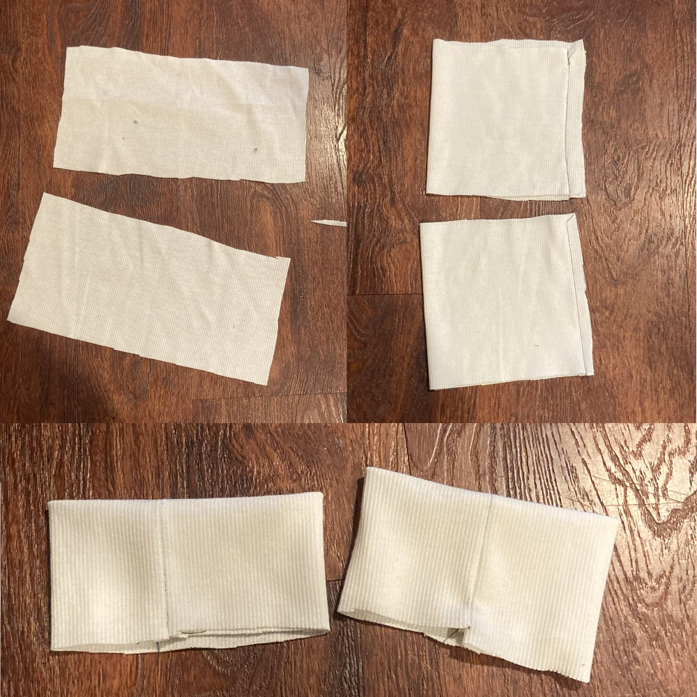

### Attach the cuffs to the first layer

You can choose whether you want to attach the cuffs to the shell or the lining first - it won't
affect the construction. I think the seams look a little neater if you do the shell first.

Take your shell and turn the sleeves right side out. Matching seams and raw edges, pin the cuffs to the
sleeves good sides together. The cuffs will be shorter than the edges of the sleeves, so you'll need to
stretch the cuffs as they're sewn.

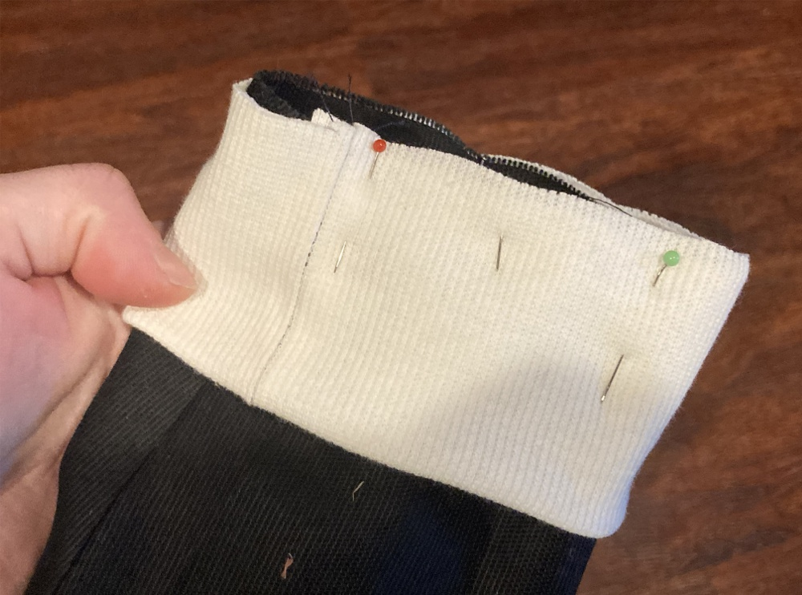

Pin this area thoroughly, moving it around to be sure the stretch is evenly distributed, before you sew
around the end of the sleeve to attach the cuff. Press the seam allowances up into the sleeve.

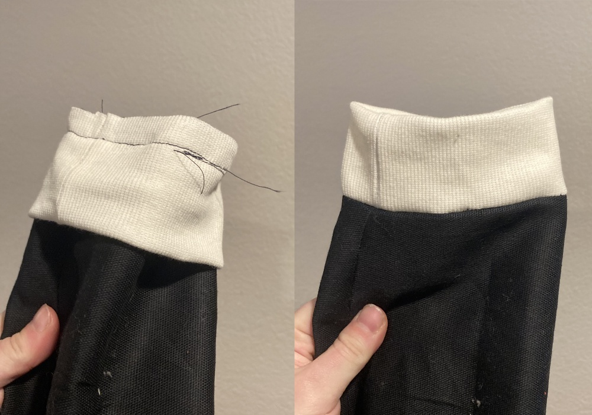

### Attach the collar

Fold the collar in half lengthwise, wrong sides together. Baste along the edge at the standard seam
allowance to hold it together. Attach this to the neck of the shell the same way you attached the cuffs.

Take note: if you're attaching this to the shell you trimmed in the first step, stretch it all the way from
one end of the neck hole to the other. If it's the piece you didn't trim, only go between the green lines.

Line it up on the right side, stretch and pin it carefully, sew along the same line of stitches you
just basted, and press the seam allowance down into the body of the coat.

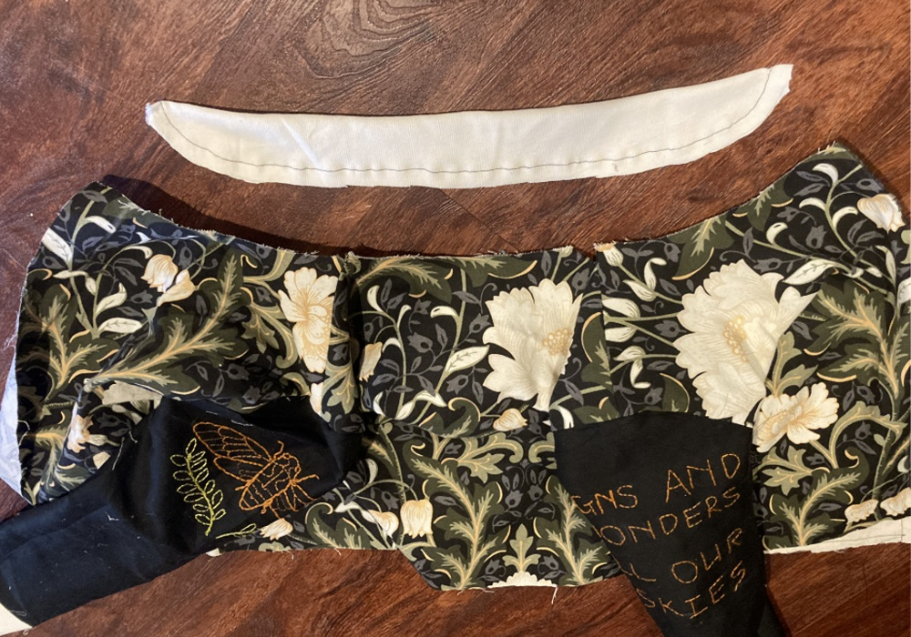

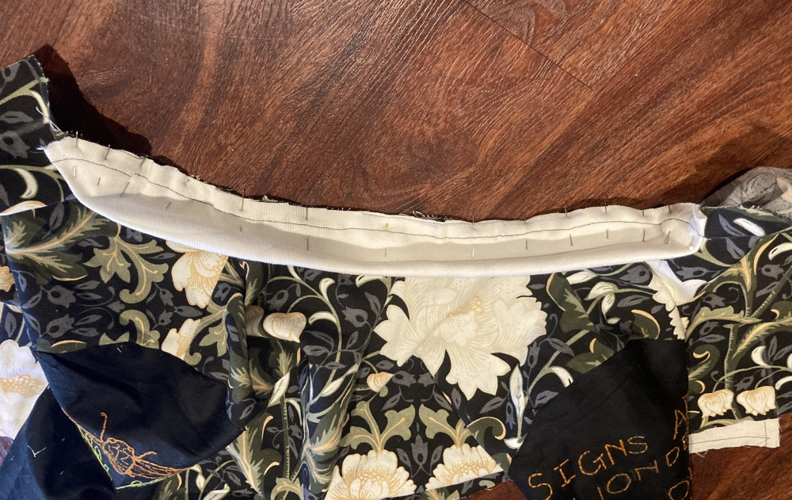

### Prepare the waistband

Sew one waistband end piece to each end of the long ribbing piece. Press these seams flat.

Fold the long piece in half lengthwide, right sides together, and sew the two ends. Turn it inside out
so the right sides are out, and press these seams at the corners so they're crisp.

### Attach the waistband

This step depends on which side you picked for the button placket in step 1. You'll be sewing the
waistband to whichever piece you didn't trim. Align the edges of the waistband ends at the same green
lines and pin them in place. Just like with the cuffs, the waistband is shorter than the jacket hem, so
you'll need to evenly stretch it between the two waistband ends and pin thoroughly before you sew it down.

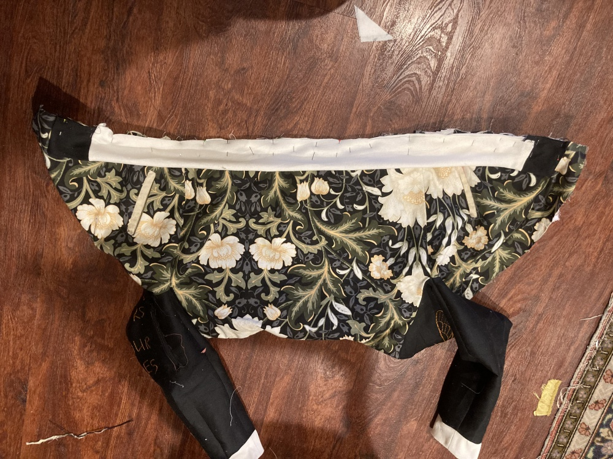

### Prepare to attach the lining

    Fold the ends of the jacket shell sleeves - or whichever sleeves you haven't attached a cuff to yet -
    to the wrong side at the standard seam allowance and press.

    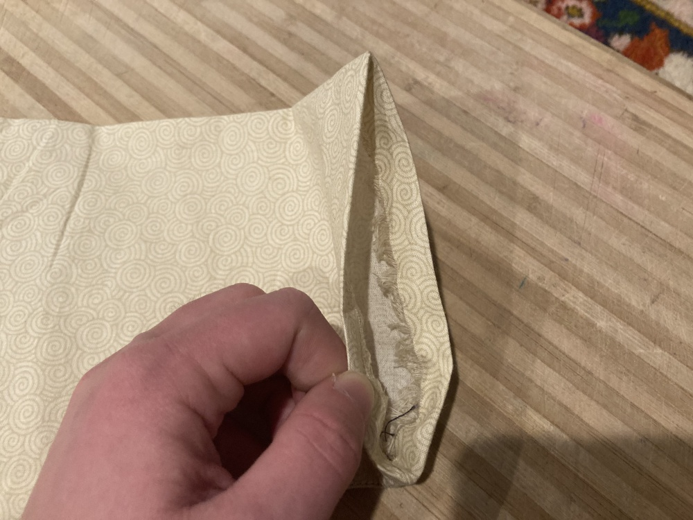

    Turn the jacket lining "wrong" side out and the jacket shell right side out.
    You'll have to take the ends of the jacket lining sleeves and feed them up through the sleeves of
    the shell, so they poke out the ends. Be careful not to twist the sleeves as you do this - the seam
    at the bottom of the sleeves should stay aligned.

### Attach the lining at the sleeves

    This is the hardest step. Starting at the bottom seam, align the folded-over edge of the sleeve
    lining with the line of stitches where you attached the cuff. Work slowly. Use a pin every
    centimeter/half-inch or so.

    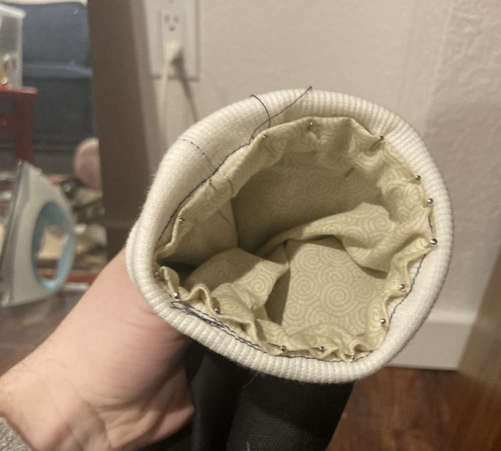

    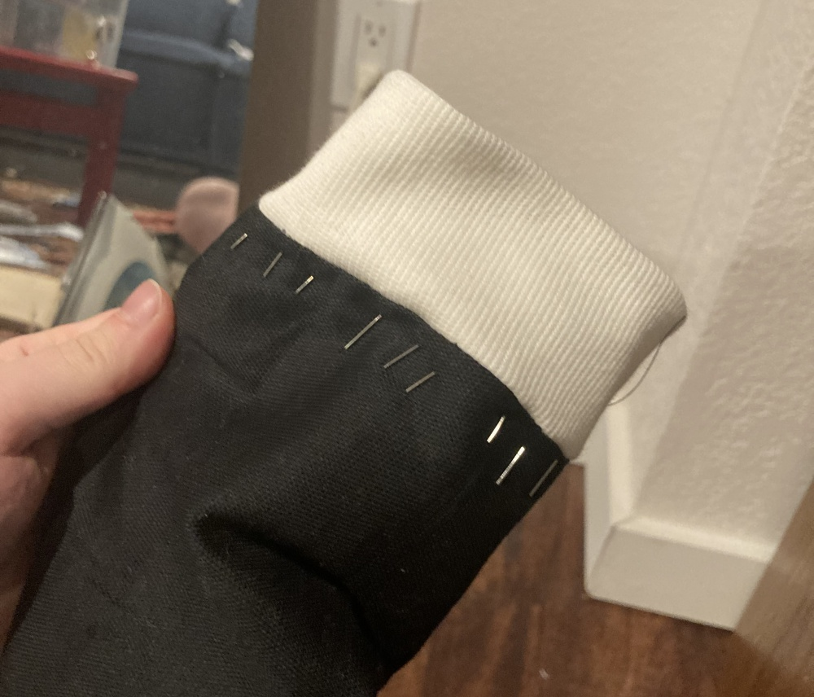

    Then sew this seam right at the folded edge. You're working in a small
    circle and through a lot of layers, so be careful and be patient.

### Baste (most of) the button plackets

    On each side of the front shell, fold the button placket over at the seam allowance and press...

    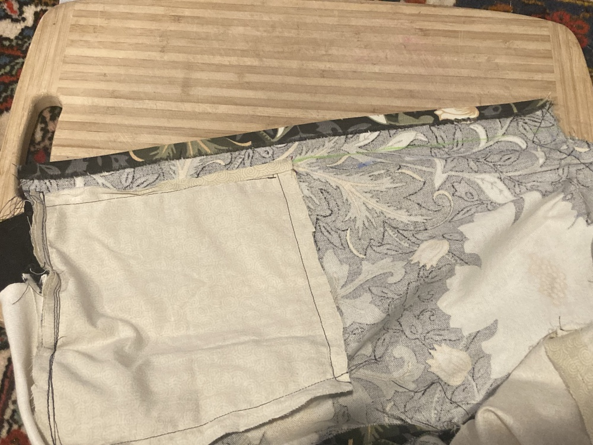

    Then fold it at the green line and press. You should be able to slip the lining layer and the
    pocket bag neatly up with the folded edge. Baste this down, but leave about an inch free at
    the top and bottom of the seam.

    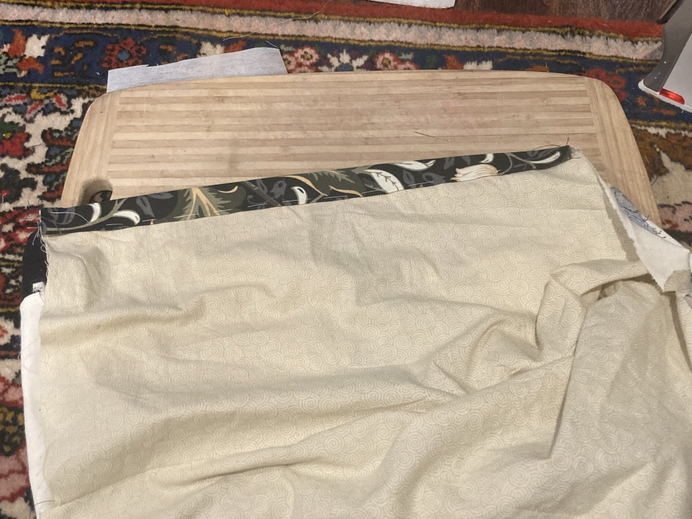

###Attach the lining at the waistband and collar

This is the same method you used to attach it at the cuffs, but easier, because you're not working in
a tiny circle.

Fold down the seam allowance of the lining along the top collar edge and the bottom waist edge. Pin the
folded edge in place, aligning it with the line of stitches that attached the waistband/collar. The raw
edges of the lining and the waistband/collar should all be enclosed up under the lining. Then sew
them down.

### Fold the button plackets and sew the waistband

    Fold the ends of the button plackets up into the jacket as you fold and align the end of the second
    layer with the line of stitching on the waistband, just like you did with the cuffs.

    Repeat the same process to neaten up the top edge of the plackets at the collar.

    Once this is pinned in place, edge-stitch horizontally along the bottom of the folded edge of the
    placket, then up along the basted edge all the way to the collar.

    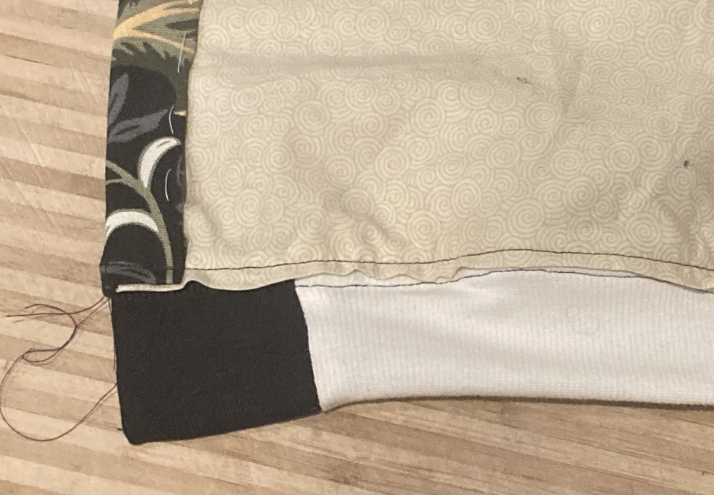

    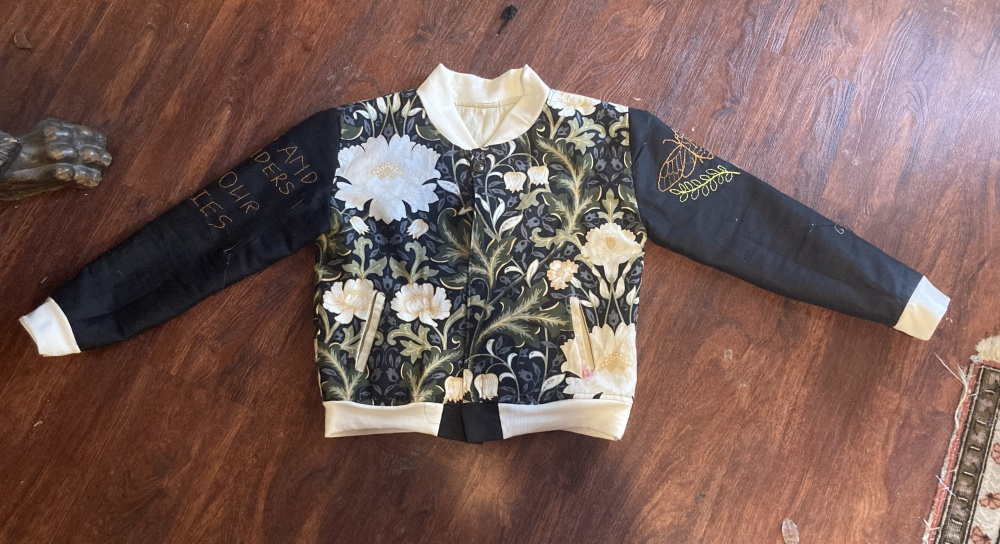

### Finish button placket

Attach buttons or snaps to the button plackets. The bottom button or snap should go on the waistband ends,
not on the shell pieces themselves.

### And you're done!
